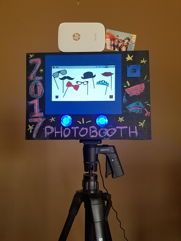

# The Pi Photobooth

This project is based off the All Seeing Pi project by the Raspberry Pi Foundation.

In general, the changes/additions I made were:

1) Added in the ability to print the photo to a bluetooth printer

2) Added in the ability to email the photo

3) Added in support for the Wii Remote which includes the ability to go to previous/next overlay, remove the overlays, take a picture and start a new picture

4) Added in some sound effects

5) Added in some graphics to the GUI

6) Added in some "snap chat" type filters to overlay the pictures (note googly eyes on dog below)

7) Uses a kill button to stop the Photobooth since it runs full screen

See the full blog post here for details https://anotherpiblog.blogspot.com/2017/06/raspberry-pi-photobooth-with-bluetooth.html
## License

Unless otherwise specified, everything in this repository is covered by the following license:

***The Pi Photobooth*** by [Mari DeGrazia](http://anotherpiblog.blogspot.com/) is licensed under a [Creative Commons Attribution 4.0 International License](http://creativecommons.org/licenses/by-sa/4.0/).

Based on a work at https://github.com/raspberrypilearning/the-all-seeing-pi
